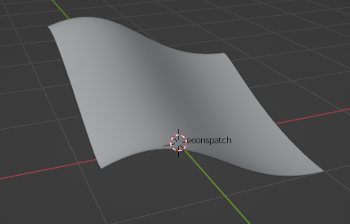

# Coonspatch-python-blender

Using Blender Scripting functionality Coons patch is implemented. The coordinates (X,Y,Z) of control points of four Bezier curves is read from the file 
coons_patch_points.txt . Each 4 lines contains the control points of a Bezier curve. The first and third lines are the coordinates of the start and 
end points of the curve, and the second and fourth lines are the coordinates of the two handle points. These four sets of control points determine the 
boundary of your Coons patch. After loading the points from the files the Coons patch is generated and rendered it in Blender.

The following is the result of coons patch from the four bezier curves in the text file.

